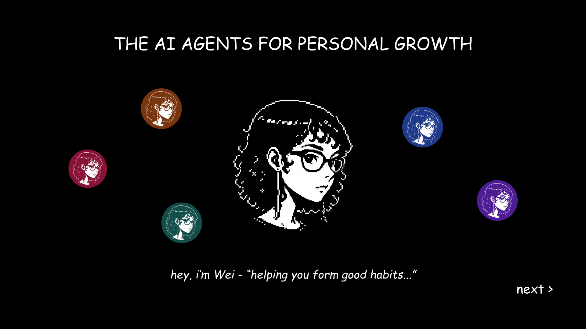
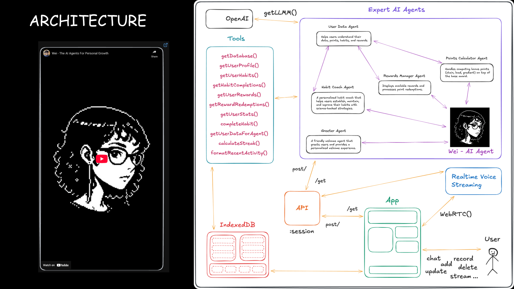
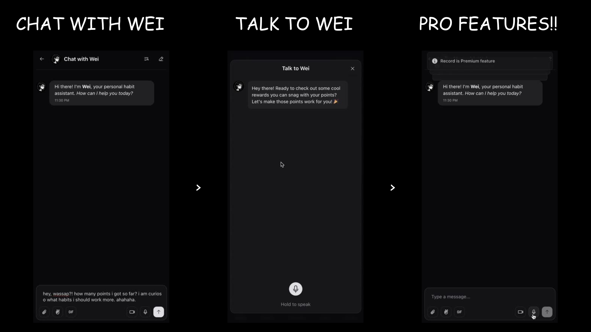
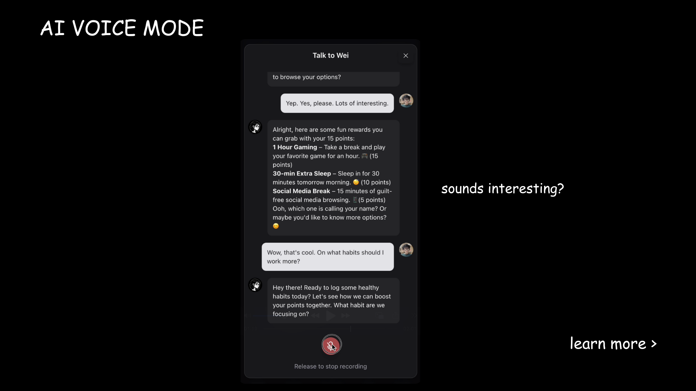
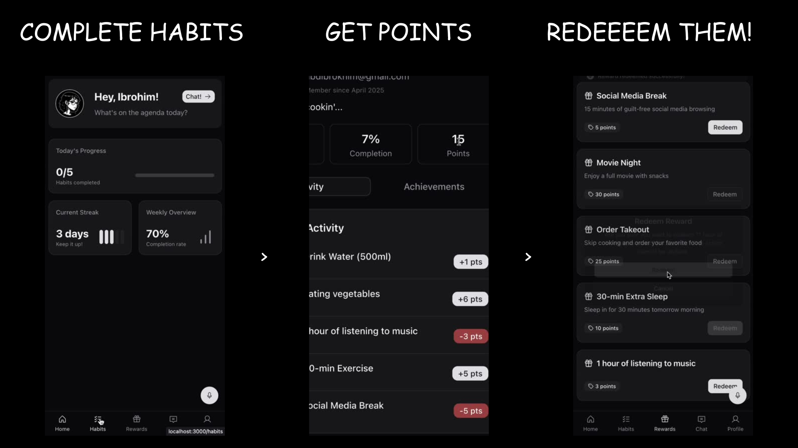
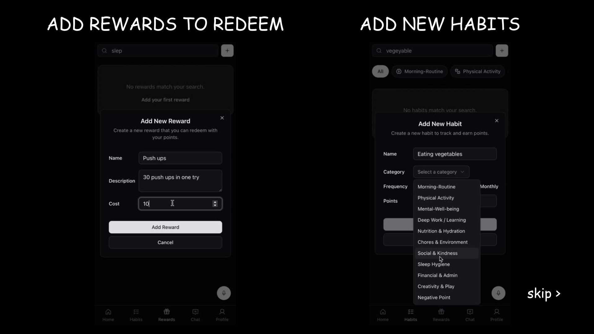

<h1> Eliza: AI Agent Orchestration
</h1>

 

  

 

<h2> Introducing Wei – The AI Agents For Personal Growth. Wei is part of the Eliza Agent Orchestration. Wei focuses on your personal growth and wellness.
</h2>

 

  

🌱 Wei is your conversational AI agent that makes habit-building effortless through natural dialogue. Speak with Wei, earn points for consistency, and transform daily routines into rewarding experiences—all with a playful personality that keeps you motivated on your wellness journey.

 

## ✨ Key Features

<table>
  <tr>
    <td></td>
  </tr>
  <tr>
    <td></td>
  </tr>
</table>

 

## 📺 Demo Video

### Introducing Eliza: AI Agent Orchestration

 

## ⚙️ Quick Start

> Check out the [INSTALLATION.md](./INSTALLATION.md) for a step-by-step guide on how to get started with Eliza Agent Orchestration.
> Deploy your own Eliza Agent Orchestration now! Check out the [DEPLOY.md](./DEPLOY.md).
